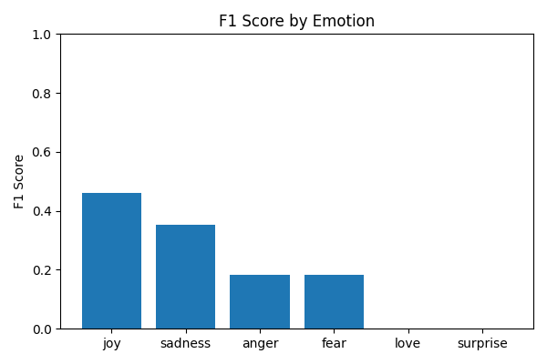
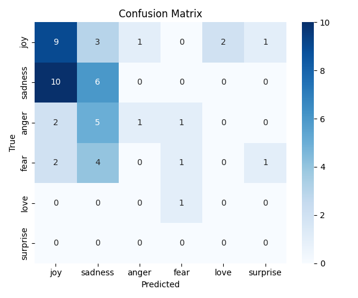

# Emotion Detection in Hebrew using HeBERT

This project implements a fine-tuned version of [HeBERT](https://huggingface.co/avichr/heBERT), a BERT-based language model for Hebrew, to classify sentences into six emotional categories:

> `joy`, `sadness`, `anger`, `fear`, `love`, and `surprise`

---

## 📦 Project Structure

emotion-detection-hebrew/
│
├── train_model.py              # Fine-tunes HeBERT on labeled emotion data
├── inference.py                # Runs inference on test set, generates graphs
├── train_balanced_750.txt      # Training dataset (750 samples, balanced)
├── test.txt                    # Evaluation dataset (10–100 examples)
├── hebert_emotion_trained/     # Saved fine-tuned model
├── confusion_matrix.png        # Confusion matrix heatmap (saved by inference)
├── f1_scores.png               # F1 score bar chart (saved by inference)
├── README.md                   # Project description (this file)

---

## 🛠️ How to Run

> Requirements: Python 3.8+, PyTorch, HuggingFace Transformers, scikit-learn, matplotlib, seaborn

### 🔹 1. Train the Model

python train_model.py

This will fine-tune HeBERT on the emotion dataset and save the model in `hebert_emotion_trained/`.

### 🔹 2. Run Inference

python inference.py

This will:
- Predict emotions on `test.txt`
- Compute accuracy and F1 scores
- Save:
  - `confusion_matrix.png`
  - `f1_scores.png`

---

## 📊 Results (sample of 50 test sentences)

- 📉 **F1 Score per Emotion:**

  

- 🔄 **Confusion Matrix:**

  

---

## 📁 Dataset Format

### `train_balanced_750.txt` and `test.txt` structure:
Each line contains a sentence and its emotion label separated by a semicolon `;`

**Example:**

I feel so connected to you;love
Why did this happen to me?;anger
I'm smiling from ear to ear;joy

---

## ✍️ Author

- **Yotam Hassid** 

  NLP Course Project – 2025  
  HIT – Holon Institute of Technology

---

## 📌 Tags

`#NLP` `#HeBERT` `#EmotionDetection` `#Hebrew` `#Transformers` `#FineTuning`
